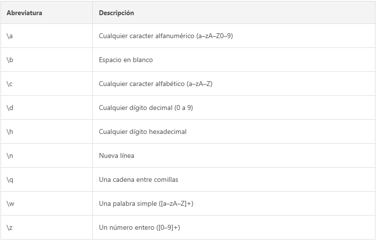
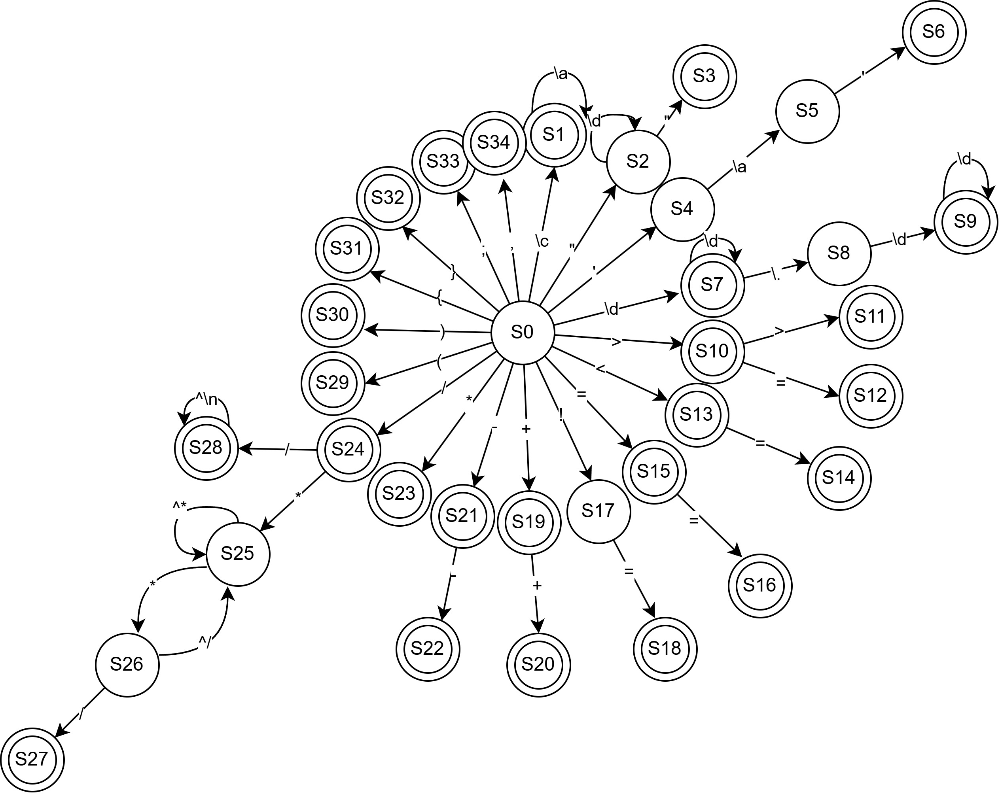

## AFD



### Tokens que reconoce
* Identificadores: Se separan en dos tipos en la implementación.
    * Palabras Reservadas
        * int: `KW_int`
        * float: `KW_float`
        * Str: `KW_Str`
        * char: `KW_char`
        * bool: `KW_bool`
        * main: `KW_main`
        * if: `KW_if`
        * else: `KW_else`
        * while: `KW_while`
        * return: `KW_return`
        * cout: `KW_cout`
        * endl: `KW_endl`
        * true: `KW_true`
        * false: `KW_false`
    * Nombres de variables: `TK_id`
* Cadenas: `TK_str`
* Caracteres: `TK_char`
* Números enteros: `TK_int`
* Números decimales: `TK_float`
* Símbolos y operadores
    * `>>`: `TK_arrow`
    * `==`: `TK_equal`
    * `!=`: `TK_notequal`
    * `<=`: `TK_lsequal`
    * `>=`: `TK_grtequal`
    * `<`: `TK_less`
    * `>`: `TK_greater`
    * `=`: `TK_assign`
    * `;`: `TK_semicolon`
    * `++`: `TK_inc`
    * `--`: `TK_dec`
    * `+`: `TK_add`
    * `-`: `TK_sub`
    * `*`: `TK_mul`
    * `/`: `TK_div`
    * `(`: `TK_lpar`
    * `)`: `TK_rpar`
    * `{`: `TK_lbrc`
    * `}`: `TK_rbrc`



## Tokens

| Lexema                 | Tipo           |
|-|-|
| `int`                  | `KW_int`       |
| `double`               | `KW_double`    |
| `Str`                  | `KW_Str`       |
| `char`                 | `KW_char`      |
| `bool`                 | `KW_bool`      |
| `main`                 | `KW_main`      |
| `if`                   | `KW_if`        |
| `else`                 | `KW_else`      |
| `while`                | `KW_while`     |
| `return`               | `KW_return`    |
| `cout`                 | `KW_cout`      |
| `endl`                 | `KW_endl`      |
| `true`                 | `KW_true`      |
| `false`                | `KW_false`     |
| `[a-zA-Z][a-zA-Z0-9]*` | `TK_id`        |
| `[0-9]`                | `TK_int`       |
| `[0-9]+\.[0-9]+`       | `TK_float`     |
| `\"[^"\n]*\"`          | `TK_str`       |
| `\'[^"\n]\'`           | `TK_char`      |
| `>>`                   | `TK_arrow`     |
| `==`                   | `TK_equal`     |
| `!=`                   | `TK_notequal`  |
| `<=`                   | `TK_lsequal`   |
| `>=`                   | `TK_grtequal`  |
| `<`                    | `TK_less`      |
| `>`                    | `TK_greater`   |
| `=`                    | `TK_assign`    |
| `;`                    | `TK_semicolon` |
| `+`                    | `TK_add`       |
| `-`                    | `TK_sub`       |
| `*`                    | `TK_mul`       |
| `/`                    | `TK_div`       |
| `(`                    | `TK_lpar`      |
| `)`                    | `TK_rpar`      |
| `{`                    | `TK_lbrc`      |
| `}`                    | `TK_rbrc`      |

## Jerarquía Operacional
|Nivel|Operación|
|-|-|
|1|`*` `/`|
|2|`+` `-`|
|3|`==` `!=` `>=` `<=` `<` `>`|

## Gramática Libre del Contexto

```html
<MAINFUNCTION> ::= 'int' 'main' '(' ')' '{' <INSTRUCTION>* 'return' TK_int '}'

<INSTRUCTION> ::=
    <INITIVAR>  |
    <ASSIGNVAR> |
    <IF>        |
    <FOR>       |
    <WHILE>     |
    <PRINT>

<INITVAR> ::=
    <TYPE> TK_id ('=' <EXP>)? (',' TK_id ('=' <EXP>)?)* ';'

<ASSIGNVAR> ::=
    TK_id '=' <EXP> ';'

<IF> ::=
    'if' '(' <EXP> ')' <BLOCK> ('else' <BLOCK>)?

<FOR> ::=
    'for' '(' <TYPE> TK_id '=' <EXP> ';' <EXP> ';' <INCDEC> ')' <BLOCK>

<INCDEC> ::=
    TK_id ('++' | '--')

<WHILE> ::=
    'while' '(' <EXP> ')' <BLOCK>

<BLOCK> ::=
    '{' <INSTRUCTION>* '}'

<PRINT> ::=
    'cout' '>>' <EXP> '>>' 'endl' ';'

<TYPE> ::=
    'int'    |
    'double' |
    'Str'    |
    'char'   |
    'bool'

<EXP> ::=
    <EXP2> (('==' | '!=' | '<=' | '>=' | '<' | '>') <EXP2>)*

<EXP2> ::=
    <EXP1> (('+' | '-') <EXP1>)*

<EXP1> ::=
    <PRIMITIVE> (('*' | '/') <PRIMITIVE>)*

<PRIMITIVE> ::=
    TK_id     |
    TK_int    |
    TK_double |
    TK_str    |
    TK_char   |
    'true'    |
    'false'
```